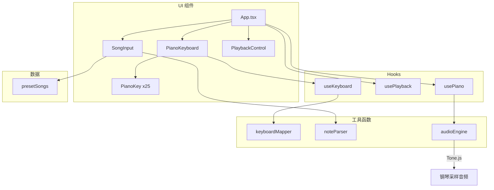
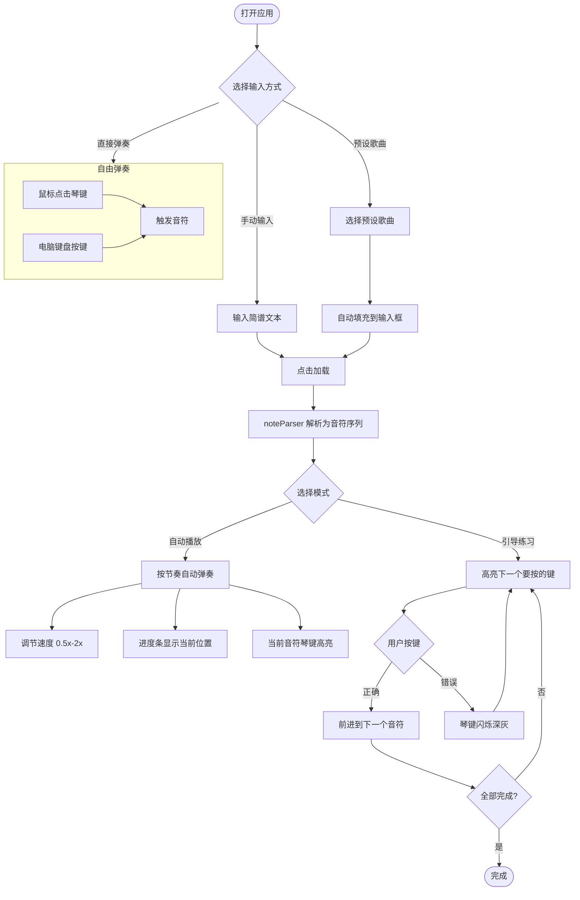
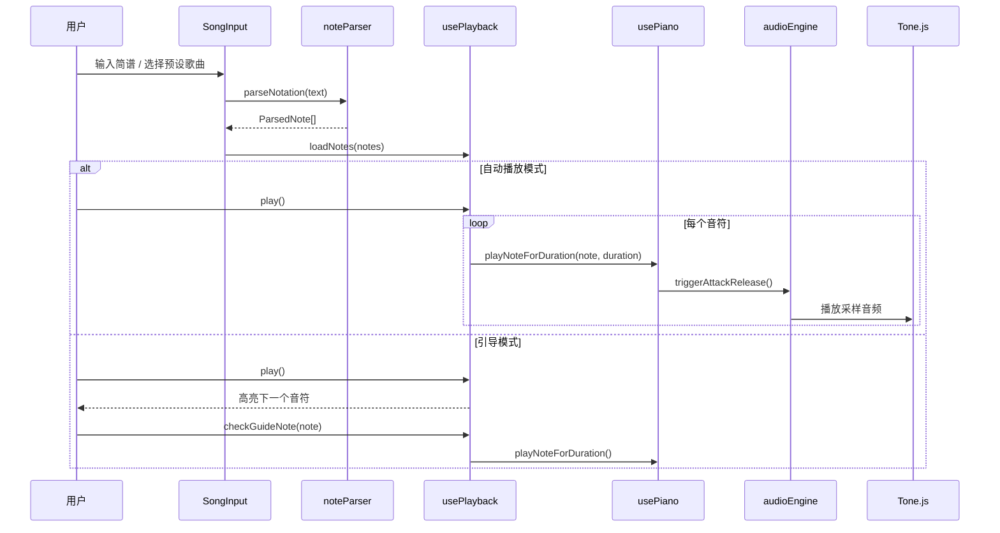

# Piano Keyboard

一个纯前端的 React 钢琴键盘应用，支持鼠标点击和电脑键盘弹奏，内置简谱解析器和预设歌曲库，提供自动播放与引导练习两种模式。

## 功能特性

- **双八度钢琴键盘** — 25 键（C3-C5），3D 渐变质感
- **电脑键盘弹奏** — 标准虚拟钢琴布局，支持双手同时演奏
- **简谱解析** — 支持数字简谱、字母音名、时值标记
- **预设歌曲** — 内置小星星、欢乐颂、生日快乐等 5 首经典曲目
- **自动播放** — 按节奏自动弹奏，支持 0.5x-2x 变速
- **引导练习** — 高亮下一个音符，跟随练习

## 架构



## 用户交互流程



## 键盘映射

```
┌───┬───┬───┬───┬───┬───┬───┬───┬───┬───┐
│   │ 2 │ 3 │   │   │ 5 │ 6 │ 7 │   │   │  ← 高八度黑键
│   │C#4│D#4│   │   │F#4│G#4│A#4│   │   │
├───┼───┼───┼───┼───┼───┼───┼───┼───┼───┤
│ Q │ W │ E │ R │ T │ Y │ U │ I │   │   │  ← 高八度白键
│C4 │D4 │E4 │F4 │G4 │A4 │B4 │C5 │   │   │
├───┼───┼───┼───┼───┼───┼───┼───┼───┼───┤
│   │ S │ D │   │   │ G │ H │ J │   │   │  ← 低八度黑键
│   │C#3│D#3│   │   │F#3│G#3│A#3│   │   │
├───┼───┼───┼───┼───┼───┼───┼───┼───┼───┤
│ Z │ X │ C │ V │ B │ N │ M │   │   │   │  ← 低八度白键
│C3 │D3 │E3 │F3 │G3 │A3 │B3 │   │   │   │
└───┴───┴───┴───┴───┴───┴───┴───┴───┴───┘
```

左手弹 Z-M（低八度），右手弹 Q-I（高八度）。

## 简谱语法

| 语法 | 含义 | 示例 |
|------|------|------|
| `1-7` | 数字简谱（默认 C4 八度） | `1 2 3` → C4 D4 E4 |
| `1.` | 高八度 | `1.` → C5 |
| `.1` | 低八度 | `.1` → C3 |
| `C D E` | 字母音名 | `C# F#` → C#4 F#4 |
| `0` 或 `-` | 休止符 | `1 0 3` |
| `3_4` | 八分音符 | 各 0.25 秒 |
| `5--` | 二分音符 | 1.0 秒 |
| `1---` | 全音符 | 2.0 秒 |
| `\|` | 小节线（忽略） | `1 2 \| 3 4` |

## 数据流



## 技术栈

| 类别 | 技术 |
|------|------|
| 框架 | React 18 + TypeScript |
| 构建 | Vite |
| 样式 | Tailwind CSS v4 |
| 音频 | Tone.js（Salamander 钢琴采样） |
| 测试 | Vitest + React Testing Library |
| 字体 | Poppins |

## 快速开始

```bash
# 安装依赖
npm install

# 启动开发服务器
npm run dev

# 运行测试
npx vitest run

# 构建生产版本
npm run build
```

## 项目结构

```
src/
├── components/
│   ├── PianoKey.tsx          # 单个琴键（3D 渐变 + 状态样式）
│   ├── PianoKeyboard.tsx     # 25 键钢琴容器
│   ├── SongInput.tsx         # 歌曲输入（预设 + 自由输入）
│   └── PlaybackControl.tsx   # 播放控制（模式 / 播放 / 速度）
├── hooks/
│   ├── useKeyboard.ts        # 电脑键盘事件监听
│   ├── usePiano.ts           # 音频引擎封装
│   └── usePlayback.ts        # 播放状态机
├── utils/
│   ├── keyboardMapper.ts     # 按键 ↔ 音符映射
│   ├── noteParser.ts         # 简谱解析器
│   └── audioEngine.ts        # Tone.js 封装
├── data/
│   └── presetSongs.ts        # 5 首预设歌曲
├── types.ts                  # 共享类型
├── App.tsx                   # 根组件
└── __tests__/                # 70 个测试用例
```

## License

MIT
